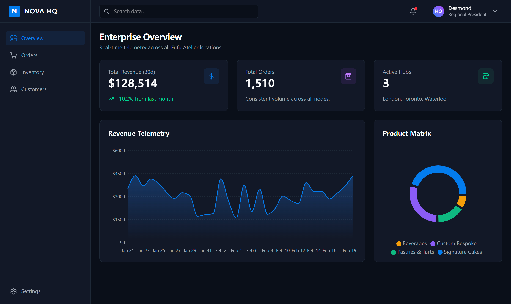

# 🚀 Nova Enterprise HQ (B2B SaaS Dashboard)

> An enterprise-grade, high-performance B2B SaaS Dashboard built to handle complex supply chain data flows, role-based permissions, and strict form validations.

## 🎯 Architecture & Tech Stack
- **Core:** React 18, TypeScript, Vite, SWC
- **Styling:** Tailwind CSS v4 (Dark Mode, Bento Grid UI), Lucide React
- **Data Visualization:** Recharts
- **State & Routing:** React Context API, React Router v6
- **Form Defense:** React Hook Form + Zod (Strict Schema Validation)
- **Data Engine:** Faker.js (Generating massive realistic mock data with simulated latency)

## 🛠️ Key Engineering Features
1. **State-Driven RBAC (Role-Based Access Control):** Dynamic routing and view generation based on user clearance (Regional President vs. Supply Chain Director) with LocalStorage persistence and Protected Routes.
2. **Hardcore Client-Side Data Matrix:** Handling 500+ mock records without rendering bottlenecks. Features complex multi-filtering, dynamic sorting, and pagination powered by `useMemo`.
3. **Ironclad Form Validation:** "End-to-End Type Safety" using Zod schemas for inventory intake, featuring silent validation and zero-render-blocking architecture.
4. **Mobile-First Responsiveness:** Intelligent Drawer/Hamburger menu and horizontal scrolling tables for seamless viewing on mobile devices.

## 📦 Local Development

\`\`\`bash
# 1. Clone the repository
git clone https://github.com/yourusername/nova-enterprise-hq.git

# 2. Install dependencies
npm install

# 3. Start the development server
npm run dev
\`\`\`